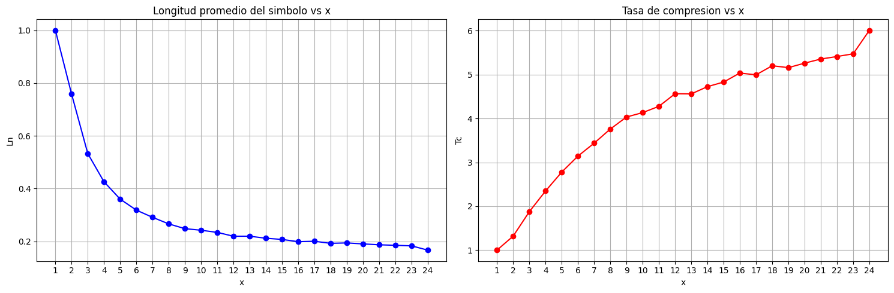

# Noisy Channel Simulation

This project simulates transmission through a noisy channel using BPSK modulation, providing tools for analyzing channel performance and error rates under various signal-to-noise ratio conditions.


## Installation

1. Ensure you have Python 3.x installed.
2. Install required packages:
   ```bash
   pip install numpy jupyter matplotlib pillow scipy
   ```

## Usage

1. Open the Jupyter notebook:
   ```bash
   jupyter notebook notebooks/channel_simulation.ipynb
   ```

2. The notebook contains examples of:
   - Basic channel simulation
   - Error rate analysis with different SNR values

## Functionality

The main functionality is in `src/channel.py`, which provides the `noisy_channel()` function for simulating BPSK transmission through a noisy channel.

### Parameters:
- `v`: Input codeword (row vector)
- `A`: BPSK signal amplitude 
- `n`: Codeword length 
- `k`: Source word length 
- `EbfN0`: Desired source bit energy to noise spectral density ratio 

### Returns:
- `vr`: Demodulated codeword (hard detection)

## Conclusion

The following graphs illustrate the performance of the BPSK modulation under different conditions:

1. **Error Rate vs. \(E_b/N_0\) (dB)**

   

2. **Error Rate Comparison**

   


These graphs demonstrate the relationship between the signal-to-noise ratio and the error rates, highlighting the effectiveness of the BPSK modulation in noisy environments.

## Huffman Compression and Source Coding

As part of the complete communication system, we implemented source coding using Huffman encoding. The input source was modeled based on symbol probabilities extracted from the input image (`input.tif`), and extended to higher orders to exploit statistical redundancy.

The Huffman encoder was automated to support arbitrary source orders (1st, 2nd, 3rd...), allowing for better compression when symbol dependencies exist. Compression performance was evaluated in terms of average codeword length and compression ratio, and compared against the theoretical entropy limit.

### Input Image


### Reconstructed Images Using Huffman Encoding + Transmission

These examples show image reconstruction after encoding with Huffman (order-3), transmission over a noisy channel with error detection and retransmission, and decoding:

- **Eb/N0 = 1 dB**

  

- **Eb/N0 = 2 dB**

  

- **Eb/N0 = 3 dB**

  

### Compression Performance

The following plot shows how compression improves as the source order increases, approaching the entropy bound:

